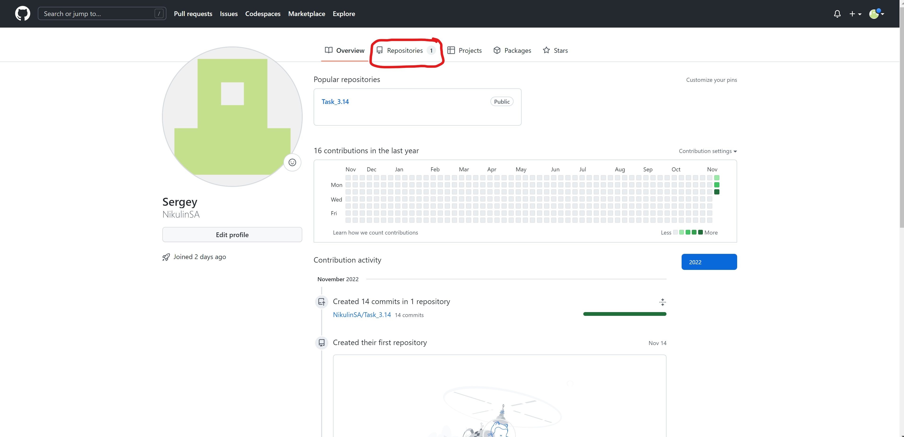
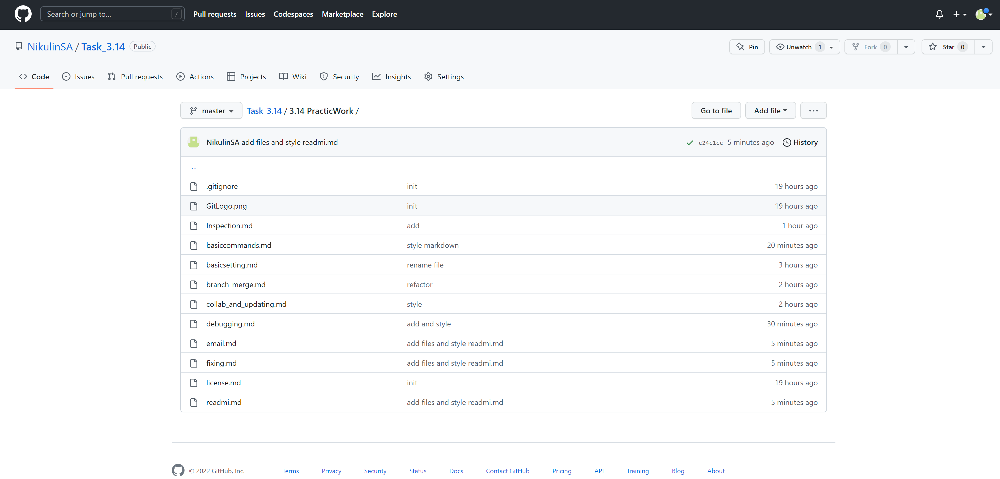
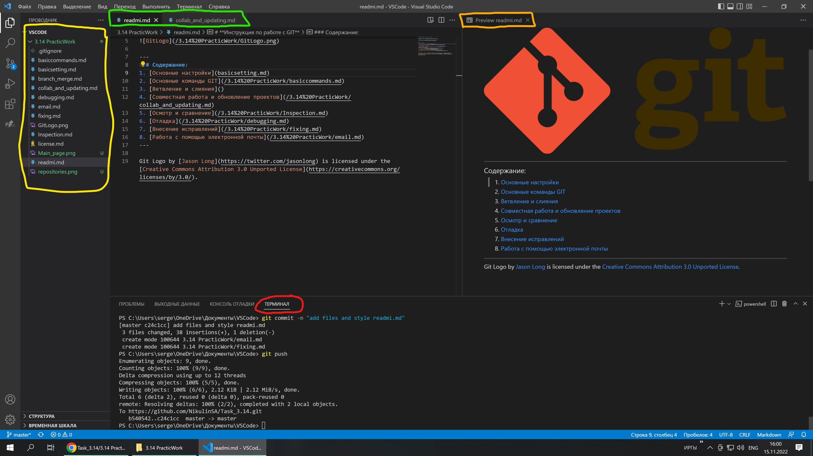

[К СОДЕРЖАНИЮ](readme.md)

---

# **Главная страница. Личный кабинет GitHub.**

> Прежде чем приступить к ознакомлению с основными командами Git для начала давайте познакомимся с интерфейсом личного кабинета на GitHub.

Все ваши проекты и работы находятся во владке Repositories .

---

Так выглядит ваш проект на GitHub со всеми его файлами.

---
Так выглядит рабочее пространство в **Visual Studio Code (VS Code)** — текстовый редактор кода для кроссплатформенной разработки веб- и облачных приложений.

На картике мы видим:
+ Проводник, где хранятся файлы на локальном устройстве.
+ Сам текстовый редактор, где пишется текст разметки.
+ Окно предварительного просмотра.
+ Терминал, в котором мы вводим команды GIT для управления и записи изменений в основную ветку проекта.

---
[ДАЛЕЕ >](basicsetting.md)